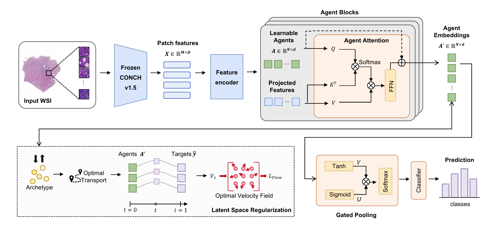

# FGA-MIL

Official PyTorch implementation of **FGA-MIL: Flow-Guided Agents for Whole Slide Image Classification**.

FGA-MIL represents a variable-length WSI bag with learnable agent tokens, refines them through cross-attention, and performs slide-level classification with gated attention pooling. During training, optional class-conditional optimal-transport flow matching regularizes the agent embeddings toward learnable class archetypes.

## Model architecture

[](assets/model.pdf)

## Repository layout

```text
.
├── assets/        # Model architecture in PNG and PDF formats
├── configs/       # Paper experiment configurations
├── data.py        # Feature loading and data splitting
├── losses.py      # Focal and cross-entropy losses
├── model.py       # FGA-MIL architecture
├── optimizers.py  # Single-device Muon with auxiliary Adam
├── train.py       # Training and evaluation entry point
└── utils.py       # Metrics, checkpoints, and result export
```

## Installation

Python 3.10 or newer is recommended.

```bash
python -m venv .venv
source .venv/bin/activate
pip install -r requirements.txt
```

Install the PyTorch build appropriate for your CUDA version if the generic installation does not match your system.

## Input data

FGA-MIL operates on pre-extracted patch features. Store each slide as:

```text
FEATURE_DIR/
├── <case_id_1>.pt
├── <case_id_2>.pt
└── ...
```

Each `.pt` file must contain a tensor of shape `[num_patches, feature_dim]`. A dictionary containing one of `features`, `feats`, `x`, `embeddings`, or `embedding` is also accepted.

The metadata CSV must contain at least:

```csv
case_id,label
slide_001,negative
slide_002,positive
```

The `case_id` must match the feature filename. Set `group_column` in a config to a patient identifier column when several slides belong to one patient; this prevents patient overlap among training, validation, and test sets.

Patch extraction is not included because FGA-MIL is feature-encoder agnostic. The experiments in the paper use non-overlapping 256 × 256 tissue patches and CONCH v1.5 features.

## Training

Run an experiment from this directory and supply the feature directory:

```bash
python train.py \
  --config configs/camelyon16_4class.json \
  --csv-path /path/to/camelyon16_labels.csv \
  --feature-dir /path/to/conch_v1_5/pt_files \
  --device cuda:0
```

Available paper configurations are listed below. Dataset metadata is not
distributed with this repository; provide it with `--csv-path`.

- `camelyon16_2class.json`
- `camelyon16_4class.json`
- `camelyon17_2class.json`
- `camelyon17_4class.json`
- `tcga_brca.json`
- `panda.json`
- `clwd.json`

Useful overrides:

```bash
python train.py \
  --config configs/panda.json \
  --csv-path /path/to/custom_metadata.csv \
  --feature-dir /path/to/features \
  --output-dir /path/to/results \
  --device cuda:1
```

Repeat `--feature-dir` when feature bags are spread across multiple directories.

## Outputs

Each run creates `outputs/<experiment_name>/` by default and saves:

- the resolved training configuration;
- the deterministic train/validation/test assignment for every fold;
- the best checkpoint for every fold;
- an epoch-level training log;
- per-fold metrics and their mean and standard deviation.

The supplied configurations use seed 42 and preserve the training settings used for the paper experiments. Hardware, CUDA kernels, and feature extraction can still introduce small numerical differences.
